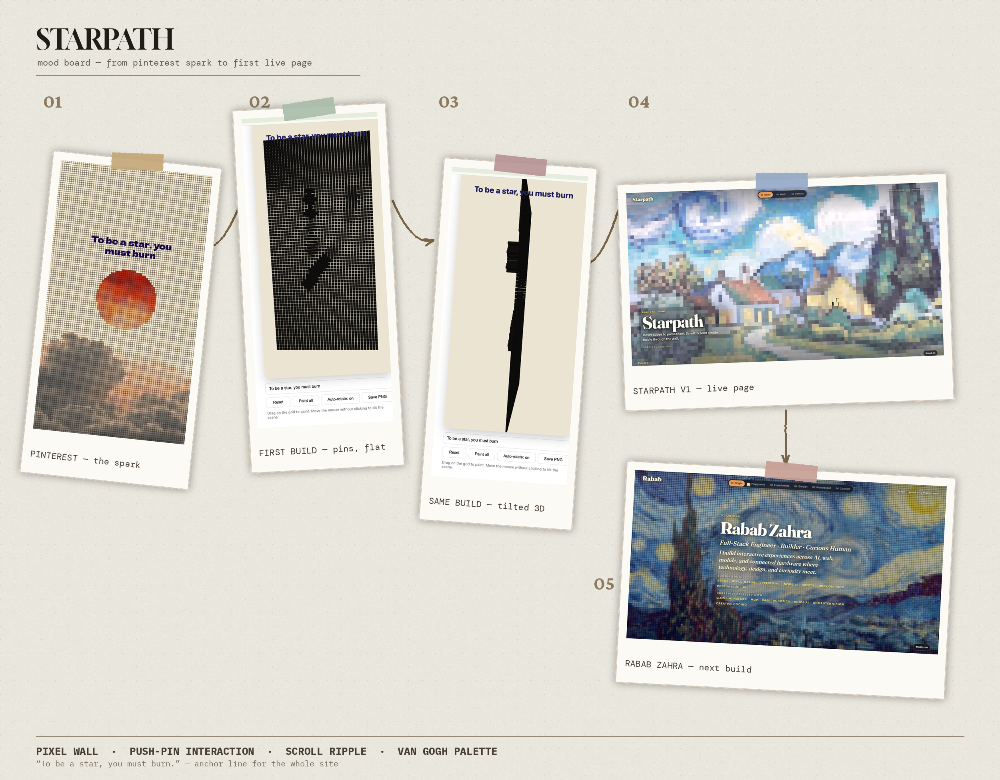

# Starpath

Personal portfolio for **Rabab Zahra** - a keyed wall of paintings you scroll through. Each chapter paints colors into a huge Three.js `InstancedMesh` of keys; hover presses them, scroll wipes row by row into the next image.

> *To be a star, you must burn.*



**From Pinterest spark → first live page:** pixel wall · push-pin interaction · scroll ripple · Van Gogh palette.

## Stack

| Layer | Choice |
| --- | --- |
| Markup / styles | Plain HTML + CSS (no framework) |
| 3D wall | [Three.js](https://threejs.org/) (`InstancedMesh`, vendored under `vendor/`) |
| Motion | [GSAP](https://gsap.com/) (chapter reveals, nav pill - vendored) |
| Audio | Web Audio / HTMLAudio for ambient track + key clicks |
| Build | **None** - static files, ES modules via import map |

No npm install. No bundler. Open with a local static server (browsers block ES modules from `file://`).

## How to run

From the project root:

```bash
python3 -m http.server 8765
```

Then open [http://localhost:8765](http://localhost:8765).

Any static server works (`npx serve`, VS Code Live Server, etc.). Point it at this folder.

### Controls

- **Scroll** - wipe between chapters (Origin → Playground → Experiments → Garden → Moodboard → Connect)
- **Hover / click keys** - press the wall (clicks always on; music is separate)
- **Music: on/off** - footer toggle for the ambient track only
- **Nav** - jump to a chapter

## Files

| File | Role |
| --- | --- |
| `index.html` | Chapters, plaques, import map |
| `style.css` | Layout, plaques, mood trail, cursor |
| `main.js` | Three.js wall, journey scroll, image sampling, audio |
| `motion.js` | GSAP reveals, nav pill, micro-interactions |
| `vendor/` | Local `three.module.js` + `gsap.js` |
| `assets/` | Chapter paintings, moodboard stills, ambient audio |

## Chapters

1. **Origin** - who I am  
2. **Playground** - how I build  
3. **Experiments** - live links  
4. **Garden** - products  
5. **Moodboard** - how the pixels started  
6. **Connect** - say hi  
